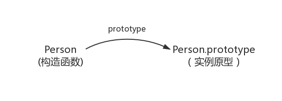
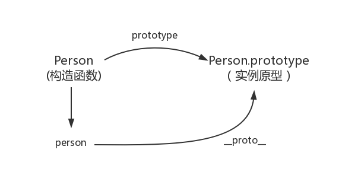

### 构造函数创建对象

#### prototype

每个函数都有一个 prototype 属性，就是我们经常在各种例子中看到的那个 prototype，比如：

```js
function Person() {}

// !!! prototype 是函数才会有的属性
Person.prototype.name = 'zhoumo';
var person1 = new Person();
var person2 = new Person();
console.log(person1.name); // zhoumo
console.log(person2.name); // zhoumo
```

其实函数的 prototype 属性指向了一个对象，这个对象正是调用该构造函数而创建的实例的原型，也就是这个例子中的 person1 和 person2 的原型。

那什么是原型呢？我们可以这么理解：每一个 JavaScript 对象（null除外）在创建的时候就会与之关联另一个对象，这个对象就是我们所说的原型每一个对象都会从原型“继承”属性。

用一张图表示 构造函数 和 实例原型之间的关系



那么我们该怎么表示 实例 和 实例原型 之间的关系，也就是 `person` 和 `Person.prototype` 之间的关系呢，这个时候就要讲到第二个属性：

#### __proto__

这是每一个 JavaScript 对象（除了null）都具有的一个属性，叫 __proto__，这个属性会指向该对象的原型。
为了证明这一点，我们可以在谷歌浏览器中输入：

```js
function Person() {}

var person = new Person();
console.log(person.__proto__ === Person.prototype); // true
```

于是更新关系图如下：


