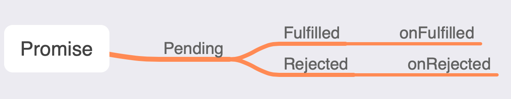

### Promise

`Promose` 就是一个对象，用来表示一个异步任务最终结束过后是成功，还是失败。就涉及到承诺状态的更改，状态变更后的对应的回调函数钩子



#### 梳理 Promise 要点

* Promise 是一个类，在执行这个类的时候，需要传递一个执行器进去，执行器会立即执行
* Promise 有三种状态，分别为：成功（fulfilled）、失败（rejected）、等待（pending）
  * 状态更改 pending -> fulfilled、pending -> rejected 一旦状态更改就不可以更改
* resolve 和 reject 函数是用来更改状态的
  * reslove: 更改状态为 fulfilled
  * reject: 更改状态为 rejected
* Promise 中的 then 方法内部做的事情就是判断状态，然后调用对应回调函数。状态是成功，调用成功回调函数；状态是失败，调用失败回调函数。
* then 是 Promise 实例调用的，then 方法定义在原型对象中的
* then 成功回调函数有一个参数，表示成功的值，resolve 函数传入成功的值；then 失败后的回调有一个参数 表示失败后的原因。reject 喊出传入失败的原因。

```js
new Promise((resolve, reject) => {

})

(resolve, reject) => {} // 相当于执行器
```

##### Promise 核心逻辑

```js
const PENDING = 'pending';
const FULFILLED = 'fulfilled';
const REJECTED = 'rejected';

class MyPromise {

  status = PENDING;
  // 成功的值
  value = undefined;
  // 失败的原因
  reason = undefined;

  constructor (executor) {
    executor(this.resolve, this.reject);
  }

  // 定义成箭头函数 我们在外部调用 函数内部的 this 指向 promise 实例
  resolve = (value) => {
    // 如果状态不是等待，阻止程序向下执行
    if (this.status !== PENDING) return;
    // 修改状态为 fulfilled
    this.status = FULFILLED;
    // 保存成功之后的值
    this.value = value;
  }

  reject = (reason) => {
    // 如果状态不是等待，阻止程序向下执行
    if (this.status !== PENDING) return;
    // 修改状态为 rejected
    this.status = REJECTED;
    // 保存失败的原因
    this.reason = reason;
  }

  then (successCallback, failCallback) {
    // 判断状态
    if (this.status === FULFILLED) {
      successCallback(this.value)
    } else if (this.status === REJECTED) {
      failCallback(this.reason)
    }
  }
}
```

##### Promise加入异步逻辑

* Promise 处理异步情况，当调用 then 方法状态为 pending 时，此时上面没有做任何处理。
* pending 时保存 成功回调 和 失败回调
* 外部调用 resolve 或 reject 时，调用回调

```js

class MyPromise {
  // 成功回调
  successCallback = undefined;
  // 失败回调
  failCallback = undefined;

  constructor (executor) {
    executor(this.resolve, this.reject);
  }

  // 定义成箭头函数 我们在外部调用 函数内部的 this 指向 promise 实例
  resolve = (value) => {
    // ...
    this.value = value;
    // resolve 函数被调用时，成功回调存在调用成功回调函数
    this.successCallback && this.successCallback(this.value);
  }

  reject = (reason) => {
    // ...
    this.reason = reason;
    this.failCallback && this.failCallback(this.reason);
  }

  then (successCallback, failCallback) {
    // 判断状态
    if (this.status === FULFILLED) {
      // ...
    } else {
      // 等到状态时 存储回调函数
      this.successCallback = successCallback;
      this.failCallback = failCallback;
    }
  }
}
```

##### Promise then方法链式调用

* then 方法是 Promise 类的实例方法，如果满足要求链式调用，那么 then 方法调用后应当返回一个 Promise 对象
* 上一个 then 方法中成功 或者 失败的回调函数返回值，如何传递到下一个then方法对应的回调函数中？ 其实只需要在返回的 Promise 对象中调用成功 或者 失败回调的地方接收上一个 then 方法的回调函数的返回值，并通过对应的 resolve 或 reject 方法传递

```js

class MyPromise {
  then (successCallback, failCallback) {
    let promise2 = new MyPromise((resolve, reject) => {
      // 判断状态
      if (this.status === FULFILLED) {
        // 接收上一个 then 方法中的成功回调函数值
        let x = successCallback(this.value);
        // 调用 resolve 向下一个 promise 的 then 方法成功回调中传递结果
        resolve(x)
      } else if (this.status === REJECTED) {
        // 接收上一个 then 方法中的失败回调函数值
        let reason = failCallback(this.reason);
        reject(reason)
      } else {
        // 将成功和失败的回调函数存储起来
        this.successCallback.push(successCallback);
        this.failCallback.push(failCallback);
      }
    });
    return promise2;
  }
}

```
